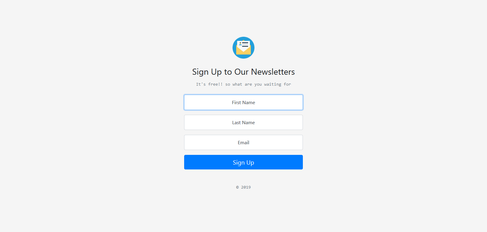

<!-- PROJECT TTITLE -->

  <h1 align="center">:mailbox_with_mail: Subscribe To My Newsletter :mailbox_with_mail:</h1>
  <p align="center">
    Mailchimp Newsletter Sign Up Page 
    <br />
    <a href="https://github.com/xvferdy/subscribe-to-my-newsletter2"><strong>Explore the docs »</strong></a>
    <br />
    <br />
    <a href="https://warm-mountain-12994.herokuapp.com">View Demo</a>
    ·
    <a href="https://github.com/xvferdy/subscribe-to-my-newsletter2/issues">Report Bug</a>
    ·
    <a href="https://github.com/xvferdy/subscribe-to-my-newsletter2/issues">Request Feature</a>
  </p>


<!-- ABOUT THE PROJECT -->

##  :one: About The Project
The web app that we're going to be build is a newsletter app :newspaper_roll:
So if you are somebody who wants to set up your own newsletter where you want to email people who are interested in hearing         from you, Well then you need a sign up page.

This is what we're going to be building :arrow_heading_down:


It's a single page web site that looks pretty nice. And on the front end it looks incredibly simple.
But on the backend it's got some powerful functionality that will allow you to sign people up to your mailing list.

So this is going to be a really cool and really useful website, it's all down to integration with the MailChimp and we're going to explore how to work with API and how to post data and communicate with their server in order to send them pieces of data that
we want them to hold on to :muscle:


### :wrench: Built With
* [Javascript](https://www.javascript.com/) - Most commonly used as a client side scripting language
* [Bootstrap](https://getbootstrap.com) - Extensive list of components and Bundled Javascript plugins
* [Express](https://expressjs.com/) -  Framework used for Node and it is most commonly used as a web application for node.js

- - - -

<!-- GETTING STARTED -->

## :two: Getting Started
These instructions will get you a copy of the project up and running on your local machine for development and testing purposes.

### :ballot_box_with_check: Prerequisites
* [Node.js](https://nodejs.org/en/)
* [Git](https://git-scm.com/) 
* [npm](https://www.npmjs.com/)
* [Mailchimp account](https://login.mailchimp.com/signup/) :point_right: good platform for our app
* [Heroku account](https://signup.heroku.com/) :point_right: free deployment


### :package: Installation
- Download this repo
- Install NPM packages:
```sh
npm install
```
- - - -

<!-- USAGE EXAMPLES -->

## :three: Usage
You can run this project locally on your machine, and make it live by following below steps.

### :man_technologist: Step 1. Setting up your mailchimp's API key and list ID
* You can get the API KEY by making it directly from your mailchimp account
* And LIST ID by creating a new audience (created also on your mailchimp account)
* Make **.env** file from this project folder then Copy your API KEY and LIST ID into it

### :man_technologist: Step 2. Running it locally
* Run `node app.js`
* Go to http://localhost:3000/

### :man_technologist: Step 3. Deploy on heroku   
* [install heroku CLI](https://devcenter.heroku.com/articles/getting-started-with-nodejs#set-up)
* Open your favorite CLI, 
  * `heroku login`
  * Check `node --version` :point_right: is it greater than v8 ?
  * Check `git --version` and `npm --version` :point_right: need to be installed
  * `git add .`
  * `git commit -m "Initial commit"`
  * `heroku create`
  * `git push heroku master`
  
| </br>Node | []()</br>Git | [](https://www.npmjs.com/)</br>Npm |
| --------- | --------- | --------- |
| > v8.0.0 | installed | installed |

_Full Documentation :point_right: https://devcenter.heroku.com/articles/getting-started-with-nodejs_

- - - -

<!-- CONTACT -->

## :four: Contact
:nerd_face: Berlianto Ferdynand. P. - xv.ferdygamer@gmail.com

- - - -

<!-- CREDITS -->

## :five: Credits and acknowledgements
### :clap: Credits
* [npm](https://www.npmjs.com/) - The default package manager for the JavaScript runtime environment Node.js 
* [The Coding Train](https://www.youtube.com/watch?v=B8ireAeWRQk) :tv:
* [@londonappbrewery](https://github.com/londonappbrewery)
* [@yu_angela](https://twitter.com/yu_angela?lang=en)

- - - -

<!-- PROJECT SHIELDS -->


